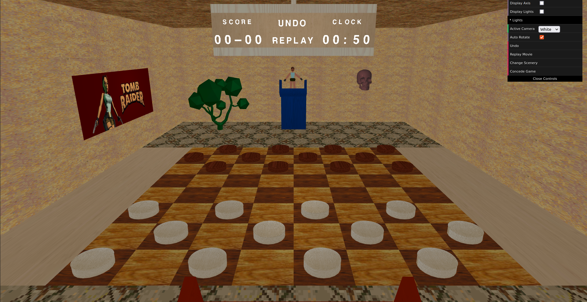

# SGI 2022/2023
This repository contains the projects developed for the course of Computer Graphics (SGI) of the Master in Informatics and Computing Engineering (MIEIC) at FEUP.

## Structure
- [`/tp1/`](./tp1/) contains the work developed for the first project. Where we developed a scene based on the famous video-game character Lara Croft, inspired by the original game from 1996.
- [`/tp2/`](./tp2/) is the continuation of the previous part. The main objective was to explore some more advanced *WebGL* techniques, namely: **NURBS**, **Shaders**, and **Animations**.
- [`/tp3/`](./tp3/) consists of a graphical interface for the board game "Checkers", with the help of the parser developed in the first and second assignments. We also reutilized some elements of the previous scenes and developed new ones.

----

## Deployed versions
1. [TP1](https://web.fe.up.pt/~up201906682/sgi/tp1/?file=testScene.xml)
2. [TP2](https://web.fe.up.pt/~up201906682/sgi/tp2/?file=testScene.xml)
3. [TP3](https://web.fe.up.pt/~up201906682/sgi/tp3/)

---

## Main Highlights
Lara Croft's Backflip

Human-sized Checkers Board inspired on a *Yu-Gi-Oh* scene

## Projects

### [TP1 - Main Features](./tp1/)
- Robust parser capable of analyzing a XML and subsequently display the scene described in it.
- Base WebGL primitives powering the developed scenes.
- Effort to make the code organized and as modular as possible.
- Scene capable of properly displaying the project's features.
- The code is regularly documented.
- There is an interface to control the scene's views and lights.
- Scene
  - Inspired by the 1996 Tomb Raider.
  - Focused on the main charater, Lara Croft.
  - Displays an ancient temple full of pillars.
  - Makes use of several textures to recreate the aspect of the original game.

-----

### [TP2 - Main Features](./tp2/)
- Robust parser capable of analyzing a XML and subsequently displaying the scene described in it.
  - Added support for specifying the 'w' property of each control point in the NURBS. If not specified, it is assumed to be 1.
- Base WebGL primitives powering the developed scenes.
- Effort to make the code organized and as modular as possible.
- Scene capable of properly displaying the project's features.
- The code is regularly documented.
- Interface folder to toggle the `highlighted` property of components.
- Scene
  - Inspired by the 1996 Tomb Raider.
  - Focused on the main charater, Lara Croft.
  - Displays an ancient temple full of pillars.
  - Makes use of several textures to recreate the aspect of the original game.
  - Secondary ambient inspired by the `Nether` world from Minecraft, activated by pressing the `m` key.
  - Added components using the created NURBS, such as the **Barrels**, the **Tent**, and the **Poster** in the wall.
- Animations
  - It's possible to animate components by using keyframes and transformations. These work hierarchically and can be shared between components.
  - We tried to make the animations as efficient as we could. When updating them, instead of updating all the components, we only update the ones that are actually animated (if an animation is shared then it only updates once). The current keyframe(s) are retrieved by using binary search with the current timestamp.
  - The animations are interpolated between keyframes.
  - The inteface has a button to reset the animations.

----

### [TP3 - Main Features](./tp3/)
- Two different scenes with a lot variety (detail over quantity).
- Well composed animations for some objects and when changing cameras.
- Automatically rotating cameras between players' perspectives on the respective turns.
- Extra options in the DAT GUI interface, such as the ability to concede the game, change the theme in the middle of it, change cameras and the option to toggle whether to automatically rotate between players' perspectives.
- The application is fluid, even when changing themes in the middle of the game.
- Some OBJ modeling was used, for models such as the white player, tree and skull in the Yu-Gi-Oh! scene.
- Modular and organized code
- Code Documentation

## Group T01G01
| Name             | Number    | E-Mail             |
| ---------------- | --------- | ------------------ |
| Bruno Rosendo         | 201906334 | up201906334@fe.up.pt                |
| João Mesquita         | 201906682 | up201906682@fe.up.pt                |
