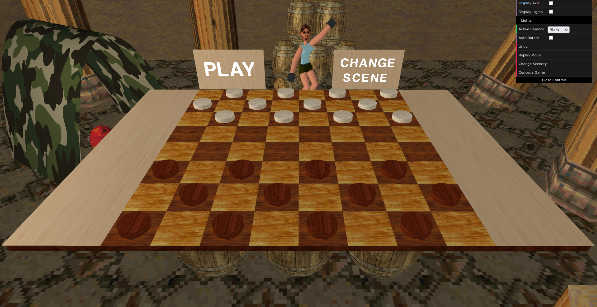
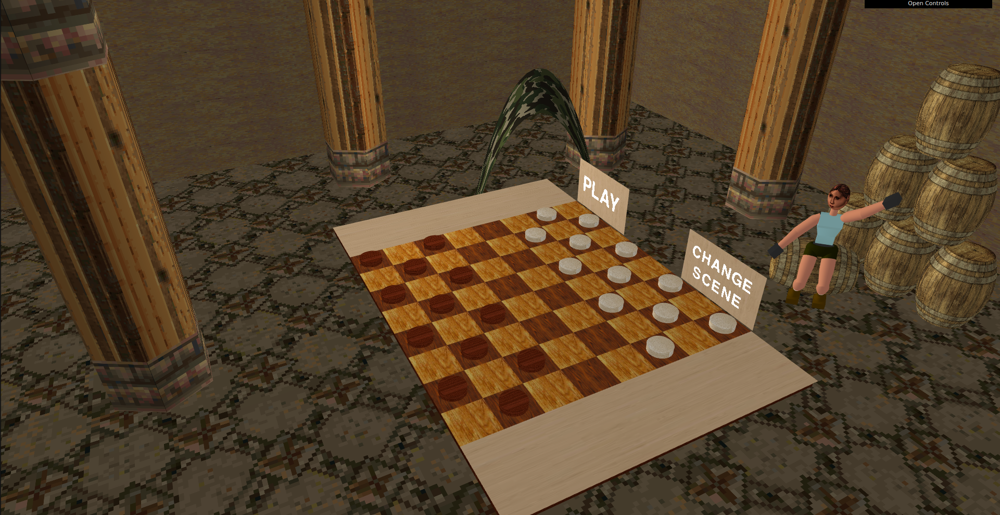
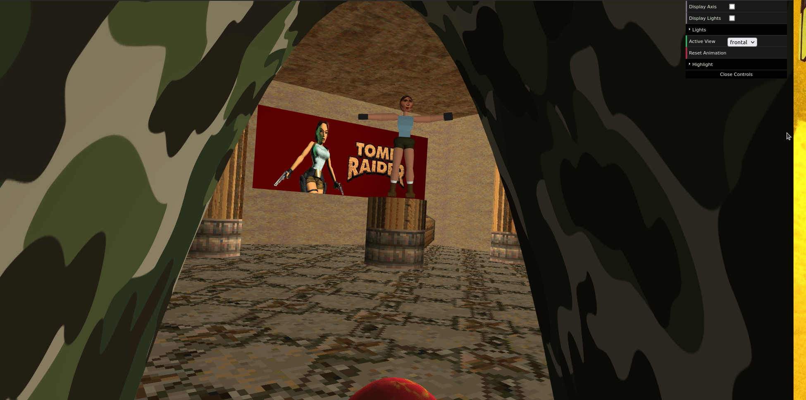
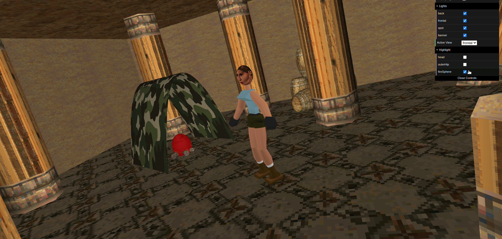

# SGI 2022/2023 - TP3

## Group T01G01
| Name             | Number    | E-Mail             |
| ---------------- | --------- | ------------------ |
| Bruno Rosendo         | 201906334 | up201906334@fe.up.pt                |
| João Mesquita         | 201906682 | up201906682@fe.up.pt                |

----
## Project information

The scene is based on the famous video-game character Lara Croft, inspired by the original game from 1996.
The character is displayed in a temple, a very iconic theme across the Tomb Raider games.

This project is the continuation of the previous one (`tp1`). The main objective was to explore some more advanced techniques, namely: **NURBS**, **Shaders**, and **Animations**.

### Main New Features:
- Robust parser capable of analyzing a XML and subsequently displaying the scene described in it.
  - Added support for specifying the 'w' property of each control point in the NURBS. If not specified, it is assumed to be 1.
- Base WebGL primitives powering the developed scenes.
- Effort to make the code organized and as modular as possible.
- Scene capable of properly displaying the project's features.
- The code is regularly documented.
- Interface folder to toggle the `highlighted` property of components.
- Scene
  - Inspired by the 1996 Tomb Raider.
  - Focused on the main charater, Lara Croft.
  - Displays an ancient temple full of pillars.
  - Makes use of several textures to recreate the aspect of the original game.
  - Secondary ambient inspired by the `Nether` world from Minecraft, activated by pressing the `m` key.
  - Added components using the created NURBS, such as the **Barrels**, the **Tent**, and the **Poster** in the wall.
- Animations
  - It's possible to animate components by using keyframes and transformations. These work hierarchically and can be shared between components.
  - We tried to make the animations as efficient as we could. When updating them, instead of updating all the components, we only update the ones that are actually animated (if an animation is shared then it only updates once). The current keyframe(s) are retrieved by using binary search with the current timestamp.
  - The animations are interpolated between keyframes.
  - The inteface has a button to reset the animations.
----
## Issues/Problems

- We think we did everything in the specification. However, we were afraid of certain scenarios where the parser could supposedly be more robust instead of displaying an error and aborting.
- The Lara Croft's animation was pretty challenging due to the complexity of the movement and the fact that we had to make it look relatively natural.
- The shader highlight animation is not very efficient if applied to many objects at once.

## Screenshots

## Gifs
### Lara Croft's Animation

### Campfire Highlighting

## References

- White Wood texture by [rawpixel.com on Freepik](https://www.freepik.com/free-photo/white-wooden-floor_4139257.htm#query=white%20wood%20texture&position=0&from_view=keyword)
- Dark Wood texture by [rawpixel.com on Freepik](https://www.freepik.com/free-photo/black-wooden-floor_4139258.htm#query=black%20wood%20texture&position=2&from_view=search&track=ais)
- Crown icons created by [feen - Flaticon](https://www.flaticon.com/free-icons/crown)

