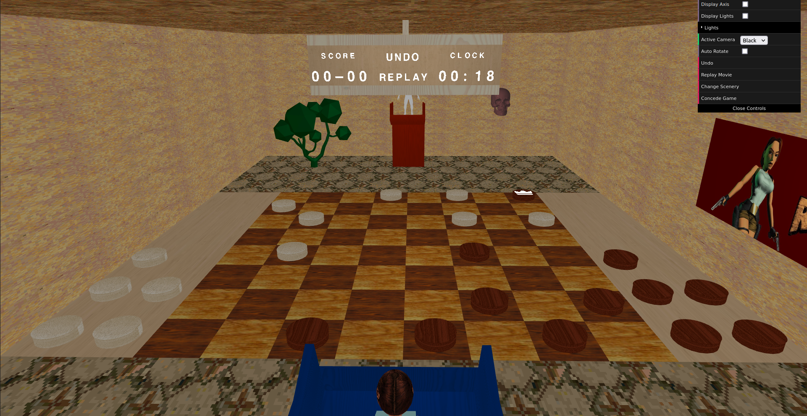

# SGI 2022/2023 - TP3

## Group T01G01
| Name             | Number    | E-Mail             |
| ---------------- | --------- | ------------------ |
| Bruno Rosendo         | 201906334 | up201906334@fe.up.pt                |
| João Mesquita         | 201906682 | up201906682@fe.up.pt                |

----
## Project information

For this third project, we implemented a graphical interface for the board game "Checkers", with the help of the parser developed in the first and second assignments.

The game is made for two players (humans), the white and the black. It follows the regular rules of checkers and begins with the player with the black pieces. This version of the game allows the checkers previously upgraded to “kings” to move any number of tiles in any diagonal direction. The game ends when either a player runs out of pieces or cannot move any of their pieces. Each player has one minute for each of their turns. If they run out of time, they instantly lose the game.

Similarly to the previous assignments, the scenes used for this project are inspired by the famous video-game character Lara Croft and the respective video-game, Tomb Rider, from 1996. One of the scenes also has some inspiration from the Yu-Gi-Oh! animated series.

### Main New Features:
- Two different scenes with a lot variety (detail over quantity).
- Well composed animations for some objects and when changing cameras.
- Automatically rotating cameras between players' perspectives on the respective turns.
- Extra options in the DAT GUI interface, such as the ability to concede the game, change the theme in the middle of it, change cameras and the option to toggle whether to automatically rotate between players' perspectives.
- The application is fluid, even when changing themes in the middle of the game.
- Some OBJ modeling was used, for models such as the white player, tree and skull in the Yu-Gi-Oh! scene.
- Modular and organized code
- Code Documentation
----
## Issues/Problems

- We think we did everything in the specification and some little extras.
- We had some scenaris where we wanted to do slightly different than the specification (for a better game experience) but were unsure as to whether we should do it. An example of this is the absence of the global timer, which seemed unintuitive for the players and didn't highlight any technical skills, since it's the game implementation as the turn clock. We also wanted to select a random play when the turn was over, but the specification asked for the player to concede the game, so we decided to follow it.

## Screenshots

## Gifs

## References

- White Wood texture by [rawpixel.com on Freepik](https://www.freepik.com/free-photo/white-wooden-floor_4139257.htm#query=white%20wood%20texture&position=0&from_view=keyword)
- Dark Wood texture by [rawpixel.com on Freepik](https://www.freepik.com/free-photo/black-wooden-floor_4139258.htm#query=black%20wood%20texture&position=2&from_view=search&track=ais)
- Crown icons created by [feen - Flaticon](https://www.flaticon.com/free-icons/crown)
- Spritesheet taken from Moddle's example

